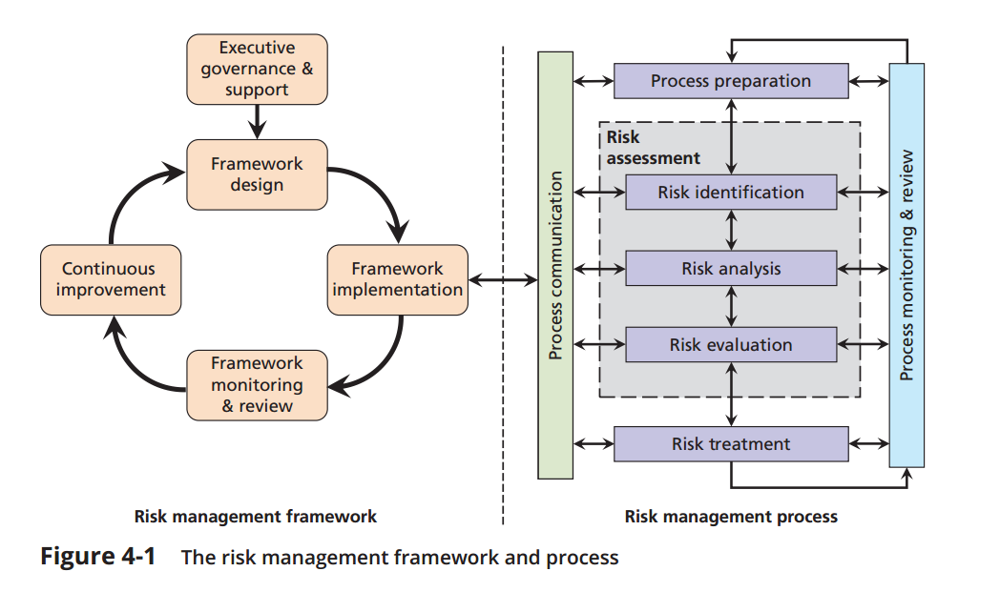

## risk management
- risk framework
  - what and where the risk? ( risk identification)
  - how severe? ( risk analysis)
  - risk ? ( evaluation )
  - risk treatment, risk on acceptable rate

- simplfy:
  - risk assesment + risk tratement
    

## 