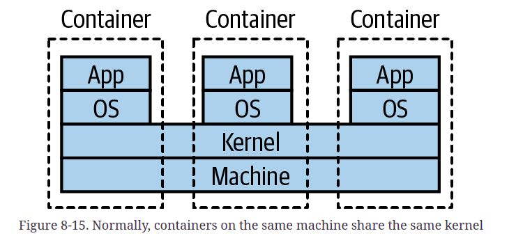

# building microservices

## 8. deployment
- one database per microservices
- environment always change
- principles:
    - isolation execution
    - automation
    - infra as a code
    - zero downtime deployment ( user or other services)
- lower cost, faster provisioning
- blue green deployment mechanism
- desired state management: kubernetes
- nomad: mirip kubernetes, tapi ga perlu container
- gitops: infras as code, chef and puppet
- deployment:
    - physical machine
    - VM
    - container
    - PAAS
    - FAAS
- VM:
    - think like a sockdrawer
    - what should we do, when we keep add partitioning?
    - type 2 virtualization: VM run on an OS
    - type 1 virtualization: VM run directly on hardware
    - autoscaling group in GCP and others
- Container:
    - LXC
    - container can have several OS, but using same kernel 
    - virtual isolation
    - windows nano server
    - docker: image
    - kubernetes : managing lots of container accross lots of machine
- PAAS:
    - use a framework, they can provide lots ofr services for you
- FAAS:
    - serverless .. not means you dont use server, you are not managing one.
    - cuma memory yg bisa di mainin pakai FAAS.
- agregates:collection of item, treated like one

### kubernetes and container orchestration
- docker swarm, apache mesos, nomad
- parent: borg and omega
- how and when container platform are run
- kubernetes control plane, pod and node
- side car proxy, such as envoy
- pod : smallest deployable in kubernetes
- service : a stable routing endpoint
- the service to route call from and to the pod
- deploy pod that map to a service
- replica set ... desired state of the pod, ( how many, where to each etc)
- managing pod and replicaset -> deployment
- openShift, ada multitenancy
- katacoda has a good kubernetes tutorial
- CRD: common resource, extends core kubernetes API

### deployment
- feature toggle, canary release, parallel runs
- deployment -> install to environment, release -> make some part expose to user.
- Blue green deployment:
    - Blue is the live
    - Green is the new system
    - run in pararel
    - when green is ok, switch the request to green
- Canary release
    - small subset of user see the new feature
    - if all is ok, release for all
- Pararell run
    - two version at the same time
    - two request to compare
    - only use one of the result returned

## from monitoring to observability

- Aggregation of information: metric and logs
- observability ... understand the state of program, from external output
- seeing as a system
- monitoring .. something you do, to monitor the system
- before anything else, setup a log agregation tools
- corelation id
- clock skew --> NTP
- kibana is  SSPL now.
- log agregation
- metric agregation
- system tracing

## Security
- consious incompetent
- think as designing house, if you back door open, what for?
- castle principle of depth
- least priviledge
- security control:
    - preventive
    - detective -> alerting when attack happen, firewall, IDS
    - responsive -> helps 
- OWASP model:
    - identify
    - protect
    - detect
    - respond
    - recover

- seperate backup, ocasionally restoring them
- implicit trust ... when already inside the network, we trust the request
- zero trust: thinking that you are working on hostile environment
- level of data:
    - public
    - private
    - secret
- client identity -> sharing secret, or request is being signed
-  vault, mutual TLS
- HMAC, hash based message, kirim hash bareng message
- salted password hashing
- person authenticated .. principal
- MFA ... multi factor authentication
- yubikey
- JWT passing from one microservice to others
- down stream ... server, backend etc
- deputy problem, using ou own credential to access unauthorized data

## Resilency
- the ability to recover from dificulties
- robust .. can work on severay known exception
