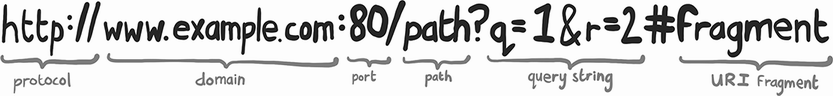
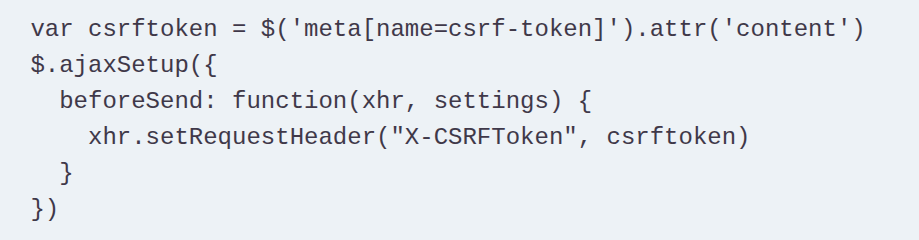

## browser security
- lock down javascript as much as possible
- content security policy
  - which type of resource can be run
  - darimana file2 itu datengnya
  - default src
  - script src
  - values
    - usafe-inline
    - unsafe-eval
  - same origin principle
    - protocol, port, domain
  - cross origin
    - writes ... pas klik
    - embed ... asal di declare di csp
    - read ... in yg di block
      - kecuali di define: access-control-allow-origin 
    - cors .. cross origin resource sharing
- cookie
  - secure;http-only
  - set-cookie: 
  - Samesite=strict

## encryption
- block cipher .. encrypt each block
- encryption in transit (TLS)
- cipher suite ... 
  - key exchange
  - authentication
  - bulk encryption
  - message authentication code (MAC)
- HSTS .. strict-transport-security
- hashing
  - salt ... taruh di database, random
  - pepper .... application wide
- integrity
  - data sudah ditampering?

## web server
- input di cek
- escaping dari input
- database di parameterize

## process
- github flow
- security in depth
- four eyes principles

## browser vulnerability
- browser attack ... ini attack ke user, daripada ke server
- xss .. cross site
  - misal forum ... di message kasih tag <script/>
  - yg umum:
    - steal:
      - username and password
      - session id
      - cookies
  - stored ... xss dari database
  - reflected ... xss dari request sendiri
   
  - uri fragment ... from DOM based
- content security: pasang ini engga bisa pake inline javascript
- CSRF ... cross site request forgery
  - link tiny url
  - bikin post
  - worm
  - making payment
  
- csrf dicombo dengan samesite=lax
- iframe ... used as invasive
- clickjacking ... div with opacity as zero
  - di csp, set frame-ancestor
  - older browser x-frame-options
- XSSI ... cross site script inclusion
  - adding our script in other websites
  - token di generate di javascript
- CORP ... cross origin request policy

## network security
- ssl predecessor of tls
- minimal tls, pake yg 1.3
- cyril alphabet, dibales sama chrome with phunny code.. give the ascii code
- dns
  - amass
  - sublister
- certificate
  - certbot
  - revoke
  - CRL, OCSP response
  - certificate transparancy logs

## authentication security
- oauth ... open authorization
- saml ... security assertion markup lang
  - combo sama LDAP
  - service provider
  - identity provider
- zxcvbn lib ... buat nilai password complexity
- TOTP ... time based one time password
- storing credentials
  - hashes, salt, pepper
- storing outbound password
  - secret manager

## session security
- session identifier
- session store, in memory session store is the default
- session state, example shopping cart
- MITM attack, session biasanya yg diambil